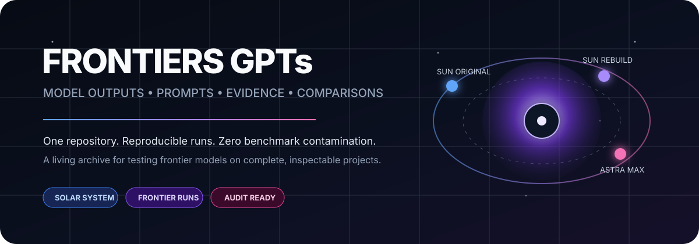

<div align="center">



<br/>

[](./benchmarks)
[](./benchmarks/solar-system/RUNS.json)
[](./docs/METHODOLOGY.md)

### One repository for serious, inspectable frontier-model comparisons.

**Exact prompts. Pinned provenance. Complete project snapshots. Explicit evidence. No hidden benchmark contamination.**

[Explore the first benchmark](./benchmarks/solar-system) · [Read the methodology](./docs/METHODOLOGY.md) · [See the architecture](./docs/REPOSITORY-ARCHITECTURE.md)

</div>

## Live experiences

<div align="center">

### ⚔️ Main benchmark

<a href="https://gpt-5.6-sun-v2.biel.dev.br"><strong>☀️ Open GPT-5.6 Sun Max — V2</strong></a>
&nbsp;&nbsp;&nbsp;•&nbsp;&nbsp;&nbsp;
<a href="https://gpt-6-astra.biel.dev.br"><strong>✦ Open GPT-6 Astra Max</strong></a>

<sub>Direct Frontier V2 arena — Sun Max, Astra Max and Grok 4.6 use the same master prompt. Live links are shown where a deployment exists.</sub>

</div>

<details>
<summary>Historical first version</summary>

The original GPT-5.6 Sun Max build is preserved only as the historical baseline:  
[GPT-5.6 Sun Max — V1](https://gpt-5.6-sun-v1.biel.dev.br)

</details>

---

## What is Frontiers GPTs?

**Frontiers GPTs** is a living benchmark archive for comparing frontier AI models on tasks large enough to expose meaningful differences in product judgment, technical execution, robustness and instruction fidelity.

The repository deliberately avoids reducing model comparison to a single screenshot or a single synthetic score. Each benchmark can preserve the entire chain of evidence:

```text
PROMPT  →  MODEL RUN  →  PROJECT SNAPSHOT  →  QA EVIDENCE  →  SCORECARD  →  VERDICT
```

A visitor should be able to answer not only **“which model won?”**, but also:

- What exact task did each model receive?
- Were the competing runs actually given the same input?
- Which commit is being judged?
- What did the model itself produce?
- What was added later by the evaluator?
- Which claims are backed by tests or screenshots?
- Did a better prompt matter more than a newer model?
- Can the result still be inspected after the original chat or hosted preview disappears?

That last point is important: the benchmark lives in Git, not in a temporary chat surface.

---

## Current arena

<table>
<tr>
<td width="25%" valign="top">

### ☀️ GPT-5.6 Sun Max
**Original run**

Historical baseline built from the first Solar System prompt.

- Prompt archived verbatim
- Source commit pinned
- Full project vendored into this hub
- Kept permanently for prompt-leverage comparison

**Snapshot:** `67eb9fc51f…`

</td>
<td width="25%" valign="top">

### 🌞 GPT-5.6 Sun Max
**Frontier V2 rebuild**

The same model family gets another full attempt under the much stronger Frontier V2 specification.

- Completely rebuilt implementation
- Source commit pinned
- Full project and QA artifacts vendored
- Exact shared V2 prompt archived and integrity verified

**Snapshot:** `93d43ae62f…`

</td>
<td width="25%" valign="top">

### ✦ GPT-6 Astra Max
**Frontier V2 challenger**

The direct frontier-model challenger using the same V2 prompt as the Sun rebuild.

- Full upstream project captured
- Source commit pinned
- Full project vendored into this hub
- Exact shared V2 prompt archived and integrity verified

**Snapshot:** `fca2ef51b4…`

</td>
<td width="25%" valign="top">

### 𝕏 Grok 4.6
**Frontier V2 challenger**

A third direct challenger generated from the same Frontier V2 input.

- Complete supplied project archived
- Same exact shared V2 prompt
- Source ZIP integrity pinned by SHA-256
- No source commit fabricated: the supplied archive contained no `.git` metadata

**Source archive:** `5d77eeb509…`

</td>
</tr>
</table>

> **Fairness rule:** the competing model should not receive the opponent's implementation, score, critique or post-hoc hints while generating its own project.

---

## Benchmark 001 — Solar System / Orbitarium

The first benchmark asks a frontier model to create a complete interactive Solar System product rather than a small demo.

It combines **visual design**, **simulation**, **camera/navigation**, **time state**, **celestial hierarchy**, **responsive behavior**, **scientific caveats**, **performance**, **accessibility**, **onboarding** and **QA** in one task.

### Why this task is useful

A simple coding benchmark can be passed through narrow algorithmic skill. A full product forces the model to keep many constraints alive simultaneously. It has to make dozens of decisions that were not explicitly specified while still respecting the requirements that were specified.

The benchmark can expose:

- whether the model creates a coherent product instead of disconnected features;
- whether visual ambition survives contact with usability;
- whether state changes break orbital/camera behavior;
- whether the model knows when scientific precision is real and when it is illustrative;
- whether mobile/accessibility requirements are treated as first-class;
- whether the final output is actually validated.

**Open benchmark:** [`benchmarks/solar-system/`](./benchmarks/solar-system/)

---

## Two comparisons inside one benchmark

Frontiers GPTs intentionally preserves both Sun generations.

### A. Prompt leverage

```text
GPT-5.6 Sun Max + original prompt
               ↓
GPT-5.6 Sun Max + Frontier V2 prompt
```

This comparison asks how much a model's output can improve when the specification becomes dramatically stronger.

### B. Frontier model comparison

```text
                         exact same Frontier V2 prompt
                    ↙                ↓                ↘
       GPT-5.6 Sun Max       GPT-6 Astra Max         Grok 4.6
              rebuild             challenger          challenger
```

This is the cleaner model-vs-model comparison because the input is shared and now archived byte-for-byte.

The repository does **not** pretend these two experiments are the same thing.

---

## Shared Frontier V2 prompt integrity

The direct frontier comparison is grounded in the exact uploaded master prompt:

| Property | Verified value |
| --- | --- |
| File | [`benchmarks/solar-system/prompts/frontier-v2.md`](./benchmarks/solar-system/prompts/frontier-v2.md) |
| SHA-256 | `7c2833a0486938c38671139807bd4a8c16371c3740175376ad02a6c0c3c06d65` |
| Size | `115,983 bytes` |
| Lines | `1,153` |
| Used by | GPT-5.6 Sun Max rebuild + GPT-6 Astra Max + Grok 4.6 |
| Verification | byte count + line count + SHA-256 passed in GitHub Actions |

The file is not a reconstruction, summary or cleaned-up variant. It is the exact supplied benchmark input.

---

## Repository map

```text
Frontiers-GPT-s/
│
├── README.md                         ← you are here
├── assets/                           ← repository visual identity
├── docs/
│   ├── METHODOLOGY.md                ← fairness + scoring rules
│   └── REPOSITORY-ARCHITECTURE.md    ← why the repo is structured this way
│
└── benchmarks/
    └── solar-system/
        ├── README.md                 ← benchmark overview
        ├── RUNS.json                 ← machine-readable provenance
        │
        ├── prompts/
        │   ├── README.md             ← prompt integrity + provenance
        │   ├── sun-original.md       ← exact historical input
        │   └── frontier-v2.md        ← exact shared V2 input, verified
        │
        ├── runs/
        │   ├── gpt-5.6-sun-max/
        │   │   ├── original/         ← immutable vendored snapshot
        │   │   └── rebuild/          ← immutable vendored snapshot
        │   ├── gpt-6-astra-max/
        │   │   └── frontier-v2/      ← immutable vendored snapshot
        │   └── grok-4.6/
        │       └── frontier-v2/      ← immutable vendored snapshot
        │
        └── comparison/
            └── SCORECARD.md          ← evidence + weighted evaluation
```

### Why not one branch per model?

Because a branch is a development line, not a category page.

Permanent model branches make the benchmark harder to browse and make comparisons less visible. Here, all completed runs live side by side on the canonical `main` branch. Branches remain available for what Git branches are actually good at: reviewing changes, staging migrations and developing the benchmark infrastructure itself.

---

## Run integrity

A run is considered fully archived only when it has:

| Requirement | Purpose |
| --- | --- |
| **Exact prompt** | proves what the model was asked to do |
| **Pinned source provenance** | freezes the output via Git commit when available, or a verified source-archive hash when Git metadata is absent |
| **Vendored snapshot** | keeps the project inspectable even if the upstream repo changes |
| **Model/run label** | distinguishes rebuilds and historical attempts |
| **Evaluation evidence** | separates observation from opinion |
| **Scorecard** | makes the comparison criteria explicit |
| **Caveats** | prevents missing evidence from becoming fake certainty |

Machine-readable run and prompt provenance is stored in [`RUNS.json`](./benchmarks/solar-system/RUNS.json).

---

## Evaluation model

The default rubric is intentionally product-heavy:

| Dimension | Weight | What it asks |
| --- | ---: | --- |
| **Feature completeness** | 20 | Did the model actually deliver the requested product? |
| **Interaction / UX** | 15 | Is it discoverable, coherent and pleasant to use? |
| **Visual execution** | 15 | Does the interface feel intentional and finished? |
| **Correctness / domain fidelity** | 15 | Does the core simulation/domain behavior make sense? |
| **Robustness** | 10 | Does it survive edge cases and state transitions? |
| **Performance** | 10 | Is the experience appropriately efficient? |
| **Code / architecture** | 10 | Is the implementation understandable and maintainable? |
| **Accessibility / responsive behavior** | 5 | Does it work beyond a desktop mouse-only happy path? |

The full rules live in [`docs/METHODOLOGY.md`](./docs/METHODOLOGY.md). The Solar System scorecard also expands these dimensions into the specific acceptance surface demanded by the 1,153-line Frontier V2 brief.

### Scores are not enough

The scorecard is paired with qualitative strengths, weaknesses, critical defects and evidence. A number without an explanation is not treated as a meaningful benchmark result.

---

## Design principles

### 01 — Generation first, evaluation second
The model produces its project before seeing opponent-specific evaluation context.

### 02 — Preserve history
A rebuild does not erase the earlier attempt. Historical runs show prompt leverage and model evolution.

### 03 — Never reconstruct missing evidence silently
If an exact prompt, commit or test cannot be recovered, the repository says so.

### 04 — Keep model output separate from evaluator output
Model-created code lives in `runs/`. Human/assistant evaluation lives in `comparison/` and `docs/`.

### 05 — Prefer inspectability over spectacle
A polished README matters, but the actual project, provenance and evidence matter more.

### 06 — Compare tasks, not mythology
A win here means a win on this documented benchmark under these conditions — not universal superiority.

---

## Visual / UX system

The repository itself is designed as a compact benchmark dashboard rather than a decorative profile README:

- a local SVG identity that does not depend on an external image host;
- status badges used as metadata, not as a wall of logos;
- a short top-level narrative with progressively deeper documentation;
- side-by-side run cards for fast comparison;
- machine-readable provenance beside human-readable explanations;
- relative links so navigation survives forks and repository moves where possible;
- evaluator templates kept out of generated run snapshots.

The design follows GitHub README conventions: make the repository immediately understandable, use relative assets for portable navigation, and use supported Markdown/HTML features for hierarchy rather than relying on fragile custom rendering.

---

## Status

| Component | State |
| --- | --- |
| Repository identity / README | ✅ established |
| Methodology | ✅ documented |
| Solar System benchmark structure | ✅ established |
| Sun Original prompt | ✅ archived verbatim |
| Frontier V2 shared prompt | ✅ archived + SHA-256 verified |
| Sun Original snapshot | ✅ imported — `67eb9fc…` |
| Sun Rebuild snapshot | ✅ imported — `93d43ae…` |
| Astra Max snapshot | ✅ imported — `fca2ef51…` |
| Grok 4.6 snapshot | ✅ imported — source archive SHA-256 `5d77eeb509…` |
| Prompt/run provenance | ✅ complete |
| V2 head-to-head scorecard | ✅ prepared; evaluation values pending |
| Final ranking | ⏳ requires evidence-backed evaluation |

---

## Self-contained archive

**Frontiers GPTs is now fully self-contained.** Every Solar System prompt and every evaluated project snapshot required by this benchmark is stored directly in this repository. There are no submodules, import jobs, runtime fetches, or repository-to-repository dependencies.

The original repository names and commit SHAs are retained only as historical provenance. Deleting those legacy repositories does not remove or alter the archived benchmark runs here.

---

## Historical provenance

The first runs originally lived in dedicated repositories before this unified archive existed. Their names and pinned commit SHAs are preserved in `RUNS.json` only as historical provenance; **Frontiers GPTs is the canonical and complete archive**.

Those legacy GitHub repositories are not required for browsing, evaluating, preserving, or extending this benchmark and may be removed without affecting the copies stored here. The public `biel.dev.br` experiences are presentation links, not archive dependencies.

The Grok 4.6 run was supplied directly as a ZIP without `.git` metadata. Its verified source-archive SHA-256 is therefore the provenance anchor; the repository does not invent a commit SHA that was never supplied.

---

## Future benchmarks

The architecture is intentionally ready for more than Solar System:

```text
benchmarks/
├── solar-system/          ← product + simulation + visual engineering
├── coding-agent/          ← autonomous implementation / repo work
├── full-stack-product/    ← application architecture + UX
├── game-development/      ← systems + rendering + interaction
├── data-analysis/         ← reasoning + quantitative communication
└── ...
```

A new task should become a new benchmark folder, **not a new top-level repository**.

---

<div align="center">

### Built to remember what the demo alone forgets.

**Input · output · evidence · comparison — in one place.**

<sub>Frontiers GPTs is an independent benchmark archive. Model names identify the systems used for individual runs.</sub>

</div>
