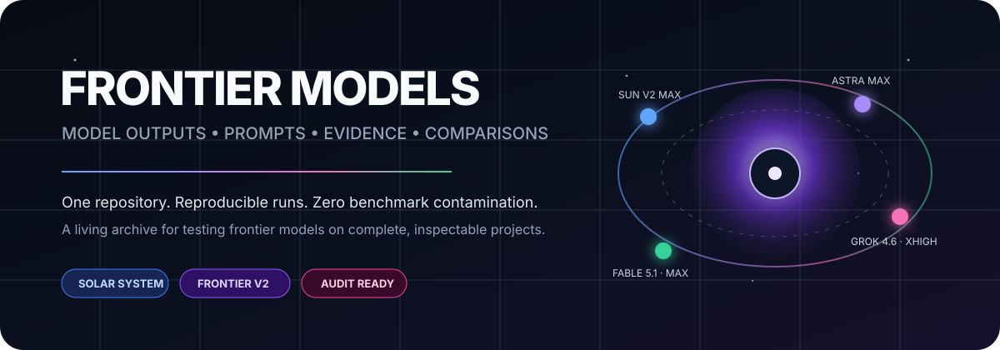

<div align="center">



<br/>

# Frontier Models

**Prompts exatos. Proveniência fixada. Snapshots completos dos projetos. Evidências explícitas.**

[English](./README.md) · [Abrir benchmark](./benchmarks/solar-system/README.pt-BR.md) · [Metodologia](./docs/METHODOLOGY.md) · [Arquitetura](./docs/REPOSITORY-ARCHITECTURE.md)

</div>

## ⚔️ Arena Frontier V2 atual

| Modelo | Execução / esforço | Projeto ao vivo | Execução arquivada |
| --- | --- | --- | --- |
| ☀️ **GPT-5.6 Sun Max** | Frontier V2 / Max | [Abrir Sun V2](https://gpt-5.6-sun-v2.biel.dev.br) | [`runs/gpt-5.6-sun-max/rebuild`](./benchmarks/solar-system/runs/gpt-5.6-sun-max/rebuild/) |
| ✦ **GPT-6 Astra Max** | Frontier V2 / Max | [Abrir Astra](https://gpt-6-astra.biel.dev.br) | [`runs/gpt-6-astra-max/frontier-v2`](./benchmarks/solar-system/runs/gpt-6-astra-max/frontier-v2/) |
| 𝕏 **Grok 4.6** | Frontier V2 / **XHIGH** | [Abrir Grok 4.6](https://grok-4-6-solar-system.vercel.app) | [`runs/grok-4.6/frontier-v2`](./benchmarks/solar-system/runs/grok-4.6/frontier-v2/) |
| ◆ **Fable 5.1** | Frontier V2 / **Max** | [Abrir Fable 5.1](https://fable-solar-system.vercel.app) | [`runs/fable/frontier-v2`](./benchmarks/solar-system/runs/fable/frontier-v2/) |

Os quatro concorrentes atuais usam **exatamente o mesmo prompt mestre Frontier V2**. O Grok está registrado em **XHIGH** e o Fable 5.1 em **Max**.

## O que é Frontier Models?

**Frontier Models** é um arquivo independente de benchmarks para comparar sistemas de IA frontier em projetos completos e inspecionáveis, em vez de capturas isoladas ou pontuações sintéticas.

```text
PROMPT → EXECUÇÃO DO MODELO → SNAPSHOT DO PROJETO → EVIDÊNCIAS → SCORECARD → VEREDITO
```

## Benchmark 001 — Sistema Solar / Orbitário

O primeiro benchmark pede a cada modelo que construa um produto completo e interativo do Sistema Solar a partir de uma especificação extensa. Ele testa design visual e de produto, simulação e lógica orbital, câmera/navegação, estado temporal, acessibilidade, desempenho, robustez, honestidade científica, ferramentas educacionais e QA.

## Proveniência das execuções atuais

| Modelo | Proveniência | Status |
| --- | --- | --- |
| GPT-5.6 Sun Max V2 | commit `93d43ae62f…` | arquivado |
| GPT-6 Astra Max | commit `fca2ef51b4…` | arquivado |
| Grok 4.6 XHIGH | SHA-256 do ZIP `5d77eeb509…` | arquivado |
| Fable 5.1 Max | commit `7e079669e41b…` | arquivado |

O prompt compartilhado exato é [`frontier-v2.md`](./benchmarks/solar-system/prompts/frontier-v2.md), SHA-256 `7c2833a0486938c38671139807bd4a8c16371c3740175376ad02a6c0c3c06d65`.

## Modelo de avaliação

Cada dimensão recebe nota de **0 a 10** e depois é convertida em pontos ponderados. O mesmo defeito não deve ser penalizado duas vezes, salvo quando evidências independentes mostrarem que ele realmente viola dois critérios distintos.

| Dimensão | Peso | Objetivo e critério |
| --- | ---: | --- |
| **Completude de recursos** | 20 | **Objetivo:** verificar se as capacidades exigidas existem e entregam o comportamento completo pretendido.<br>**Critério:** descontar por recursos ausentes, falsos, superficiais ou feitos para contornar a intenção; quebras comuns pertencem à Robustez, salvo quando tornam o recurso efetivamente inutilizável. |
| **Interação / UX** | 15 | **Objetivo:** medir clareza, descobribilidade, ergonomia, fluxo de navegação/controles e feedback quando o produto funciona como projetado.<br>**Critério:** descontar por interação confusa, não por falhas de implementação ou estado que apenas aparecem durante a interação. |
| **Execução visual** | 15 | **Objetivo:** medir hierarquia, legibilidade, coerência, qualidade de renderização e acabamento geral.<br>**Critério:** descontar por defeitos visuais ou de design persistentes; falhas funcionais só contam aqui quando prejudicam de forma independente o resultado visual. |
| **Fidelidade científica / da simulação** | 15 | **Objetivo:** medir a correção orbital, temporal, de escala e astronômica e a honestidade sobre limites de aproximação.<br>**Critério:** descontar por dados, semântica ou modelos errados; quebras de execução pertencem à Robustez salvo quando a lógica científica também estiver incorreta. |
| **Robustez** | 10 | **Objetivo:** medir confiabilidade durante uso normal, repetido e em casos-limite, mudanças de estado, resets e altas velocidades.<br>**Critério:** bugs, dessincronização, estado de câmera/seguimento quebrado, exceções, estado corrompido e comportamentos que deixam de funcionar pertencem aqui. |
| **Desempenho** | 10 | **Objetivo:** medir responsividade, estabilidade dos frames, carregamento e eficiência de recursos.<br>**Critério:** descontar por lentidão mensurável, engasgos, travamentos ou uso excessivo de recursos; correção e desenho dos controles pertencem a outras categorias. |
| **Código / arquitetura** | 10 | **Objetivo:** medir manutenibilidade, modularidade, limites de estado, disciplina de dependências, testabilidade e qualidade da validação.<br>**Critério:** descontar por fraquezas estruturais de engenharia; um bug visível não gera também penalidade arquitetural sem evidência independente no código. |
| **Acessibilidade / comportamento responsivo** | 5 | **Objetivo:** medir acesso por teclado/foco, movimento reduzido, usabilidade semântica e adaptação do layout aos tamanhos de tela-alvo.<br>**Critério:** descontar por falhas concretas de acessibilidade/responsividade; atritos genéricos de UX e bugs não relacionados permanecem em suas categorias principais. |

**Exemplo de fronteira:** se o Sol seguir incorretamente o usuário ou a câmera enquanto ele se movimenta pelo orbitário porque o estado de seguimento, câmera ou cena está quebrado, isso é **Robustez**, e não **Interação / UX**. UX só perde pontos se a própria interação for confusa mesmo quando funciona corretamente.

Veja o [`SCORECARD.md`](./benchmarks/solar-system/comparison/SCORECARD.md) e o [`README` do benchmark](./benchmarks/solar-system/README.pt-BR.md).

## Política do arquivo

- resultados dos modelos permanecem intocados dentro de `runs/`;
- material do avaliador fica fora dos snapshots;
- prompts exatos são arquivados separadamente e sem alterações;
- commits Git são usados quando existem metadados Git da fonte;
- hashes criptográficos são usados quando não existem;
- execuções históricas continuam preservadas sem poluir a arena atual.

---

<div align="center">

### Frontier Models

**Entrada · resultado · evidência · comparação — tudo em um só lugar.**

</div>
